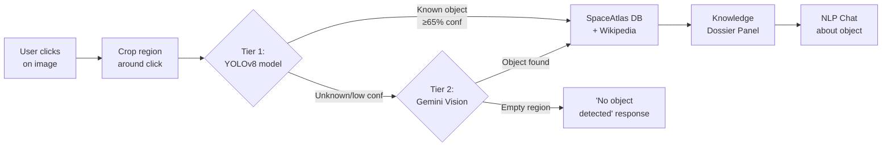

# Interactive Space Scanner — Google Lens-Style Visual Search

Build an interactive visual search system where users **click on any region** of an uploaded image to identify objects, with a custom model (Tier 1) + Gemini fallback (Tier 2), knowledge retrieval, and NLP chat.

## Architecture Overview



| Layer | What exists | What changes |
|-------|------------|-------------|
| **ML Pipeline** | YOLOv8 training script, noisy dataset | Fix dataset quality, keep training pipeline |
| **API — Identify** | `/detect` — full-image scan | **New** `/identify` — accepts click coordinates, crops region, runs Tier 1→Tier 2 |
| **API — Chat** | Nothing | **New** `/chat` — NLP follow-up about selected object with Gemini |
| **API — Lookup** | `/space-scanner` GET — class→knowledge | Keep as-is |
| **Frontend** | Upload + auto-scan + bbox overlay | **Rewrite** — click-to-identify canvas, dynamic bbox, knowledge panel, chat drawer |

---

## Proposed Changes

### 1. Dataset Quality Fix (ML Pipeline)

> [!NOTE]
> The noisy dataset issue (press conferences, people) is already partially addressed. This step ensures all classes are clean before training.

#### [MODIFY] [`fix_noisy_classes.py`](file:///c:/Users/Asus/Desktop/SpaceAltas/ml/cv/fix_noisy_classes.py)
- Already working with Wikimedia API + filtered NASA supplement
- Extend to audit ALL 39 classes, not just asteroid/comet/black_hole
- Add a visual audit mode that opens a sample grid for manual review

#### [KEEP] [`train.py`](file:///c:/Users/Asus/Desktop/SpaceAltas/ml/cv/train.py)
- YOLOv8n training stays as-is
- Will be run after dataset is cleaned

#### [KEEP] [`annotate_dataset.py`](file:///c:/Users/Asus/Desktop/SpaceAltas/ml/cv/annotate_dataset.py)
- Conversion to YOLO format stays as-is

---

### 2. API — Click-to-Identify Endpoint

#### [NEW] [`src/app/api/space-scanner/identify/route.ts`](file:///c:/Users/Asus/Desktop/SpaceAltas/src/app/api/space-scanner/identify/route.ts)

The core new endpoint. Accepts an image + click coordinates, identifies what's at that location.

**Request:**
```json
{
  "image": "<base64 or URL>",
  "clickX": 0.45,        // normalized 0-1 click position
  "clickY": 0.62,
  "mimeType": "image/jpeg"
}
```

**Logic:**
1. Receive click coordinates (normalized 0-1)
2. **Tier 1 check**: If YOLOv8 model is available, run inference — check if any detection bbox contains the click point. If yes and confidence ≥ 65%, use that detection.
3. **Tier 2 fallback**: Send the full image + click coordinates to Gemini with a prompt like: *"The user clicked at position (45%, 62%) of this image. Identify the object at that exact location. If the clicked area is empty sky, background, or contains no meaningful object, respond with `noObject: true`."*
4. **Empty region handling**: If Gemini determines the click is on empty space/sky/background, return `{ noObject: true, message: "No identifiable object at this location" }`
5. **Knowledge resolution**: For identified objects, resolve via SpaceAtlas DB → Wikipedia fallback (existing logic)

**Response:**
```json
{
  "identified": true,
  "tier": "tier1",
  "object": {
    "displayName": "Jupiter",
    "className": "jupiter",
    "confidence": 0.94,
    "bbox": [0.4, 0.5, 0.6, 0.7],
    "category": "planet",
    "observation": "Jupiter's Great Red Spot is clearly visible..."
  },
  "knowledge": { /* SpaceAtlas/Wikipedia data */ },
  "suggestedQuestions": [
    "How large is Jupiter's Great Red Spot?",
    "How many moons does Jupiter have?",
    "What is Jupiter's atmosphere made of?"
  ]
}
```

#### [DELETE] [`src/app/api/space-scanner/detect/route.ts`](file:///c:/Users/Asus/Desktop/SpaceAltas/src/app/api/space-scanner/detect/route.ts)
- Replaced by the new `/identify` endpoint

#### [KEEP] [`src/app/api/space-scanner/route.ts`](file:///c:/Users/Asus/Desktop/SpaceAltas/src/app/api/space-scanner/route.ts)
- The GET lookup route stays unchanged — still resolves class→knowledge

---

### 3. API — NLP Chat Endpoint

#### [NEW] [`src/app/api/space-scanner/chat/route.ts`](file:///c:/Users/Asus/Desktop/SpaceAltas/src/app/api/space-scanner/chat/route.ts)

Conversational follow-up about a selected object, maintaining context.

**Request:**
```json
{
  "message": "How many moons does it have?",
  "context": {
    "objectName": "Jupiter",
    "category": "planet",
    "previousMessages": [
      { "role": "user", "text": "Tell me about its atmosphere" },
      { "role": "assistant", "text": "Jupiter's atmosphere is primarily..." }
    ]
  },
  "image": "<base64>",       // optional: original image for visual context
  "mimeType": "image/jpeg"
}
```

**Logic:**
- Sends the conversation history + object context + optional image to Gemini
- System prompt constrains responses to the selected object's domain
- Returns markdown-formatted answer
- Streams response for real-time UX (using Gemini streaming API)

**Response:**
```json
{
  "answer": "Jupiter has **95 known moons** as of 2024...",
  "suggestedFollowups": [
    "Which is the largest moon?",
    "Can any of them support life?"
  ]
}
```

---

### 4. Frontend — Interactive Scanner Page

#### [REWRITE] [`src/app/space-scanner/page.tsx`](file:///c:/Users/Asus/Desktop/SpaceAltas/src/app/space-scanner/page.tsx)

Complete UX overhaul for click-to-identify interaction:

**Image Canvas:**
- User uploads image → displayed on a canvas
- **Click anywhere** on the image → sends click coordinates to `/identify`
- Animated "scanning" ripple effect radiates from click point
- When object is identified, a bounding box fades in around the detected object
- If empty region clicked, subtle "no object here" toast notification

**Knowledge Panel (right side):**
- Slides in when an object is identified
- Shows: image, name, confidence badge, observation, specs table
- Links to SpaceAtlas detail page + Wikipedia
- "Ask about this object" button opens chat

**Chat Drawer (bottom or side panel):**
- Opens when user wants to ask questions about the selected object
- Shows suggested questions as quick-action chips
- Text input for custom questions
- Streaming markdown responses
- Conversation history maintained per-object

**State Flow:**
```
IDLE → (upload) → IMAGE_LOADED → (click) → IDENTIFYING → 
  → OBJECT_FOUND → (ask question) → CHATTING
  → NO_OBJECT → back to IMAGE_LOADED
```

---

## Open Questions

> [!IMPORTANT]
> **Model inference in production**: The YOLOv8 model runs in Python. For the Tier 1 path in production, should I:
> - **Option A**: Run a FastAPI sidecar server that serves the YOLO model, and the Next.js API route calls it via HTTP
> - **Option B**: Use ONNX Runtime in Node.js (via `onnxruntime-node`) to run the model directly in the API route
> - **Option C**: Skip Tier 1 in production for now (use Gemini for everything) and add Tier 1 once the model is trained and validated
>
> I recommend **Option C** for now — ship the interactive UX with Gemini, then add the trained model as Tier 1 later once the dataset is clean.

> [!IMPORTANT]
> **Chat streaming**: Should the chat use Server-Sent Events (SSE) for real-time token streaming, or is a simple request-response fine for now?

---

## Verification Plan

### Automated Tests
- `npx tsc --noEmit` — TypeScript compiles
- `npm run build` — production build passes

### Manual Verification
- Upload a space image → click on a planet → verify bbox + knowledge panel appears
- Click on empty background → verify "no object" message (no crash)
- Ask a follow-up question → verify chat response
- Upload a non-space image → verify Gemini handles gracefully
- Test with objects NOT in SpaceAtlas DB → verify Wikipedia fallback
